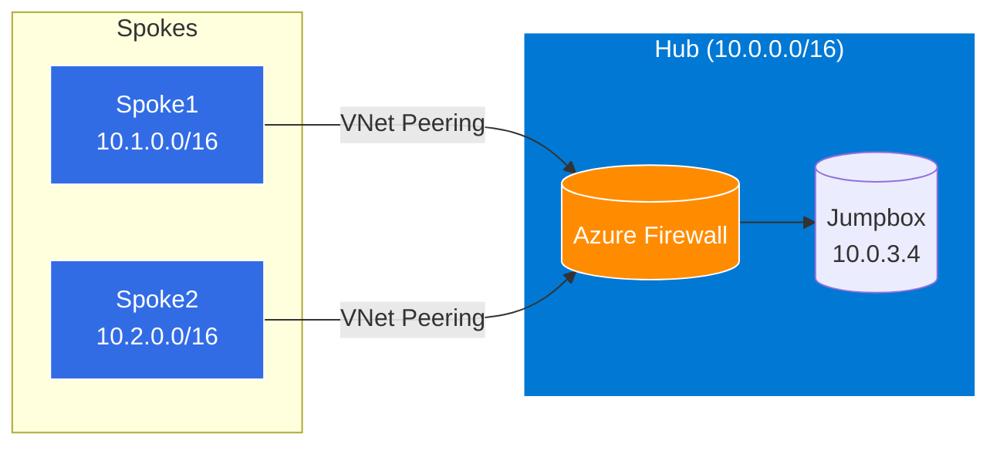

# 🚀 Architecture Hub & Spoke Azure

Projet Terraform démontrant une architecture Hub & Spoke sur Azure avec firewall centralisé et jumpbox.

## 🏗️ Architecture



## 📁 Structure

```
terraform-hub-and-spoke/
├── main.tf                 # Appelle les modules hub et spokes
├── variables.tf            # Variables (location, admin, etc.)
├── terraform.tfvars        # Valeurs
├── provider.tf             # Provider Azure
└── modules/
    ├── hub/               # VNET hub, Firewall, Jumpbox
    ├── spoke/             # Spoke 1
    └── spoke2/            # Spoke 2
```

## ⚡ Quick Start

```bash
# Initialiser Terraform
terraform init

# Valider le code
terraform validate

# Voir le plan
terraform plan

# Déployer
terraform apply

# Détruire (pour éviter les coûts)
terraform destroy
```

## 🔧 Composants

| Ressource | Description |
|-----------|-------------|
| **Hub VNET** | 10.0.0.0/16 - Réseau central |
| **Azure Firewall** | Standard SKU, Politique de règles |
| **Jumpbox** | VM Spot Ubuntu 22.04 pour accès admin |
| **Spoke1** | 10.1.0.0/16 - Premier réseau spoke |
| **Spoke2** | 10.2.0.0/16 - Deuxième réseau spoke |
| **Peerings** | Connexions bidirectionnelles hub ↔ spokes |

## 💰 Coûts

- **Azure Firewall Standard** : ~25€/jour
- **Jumpbox Spot** : ~0.01€/h
- **IP Publique** : ~3€/mois

**Penser à détruire après utilisation !**

---

**Repo** : https://github.com/julieparrot91-star/terraform-hub-and-spoke

**Portfolio** : https://julien-parrot.fr